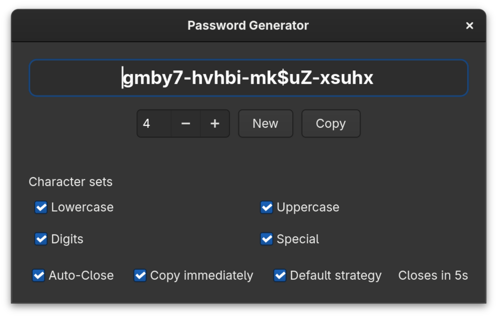
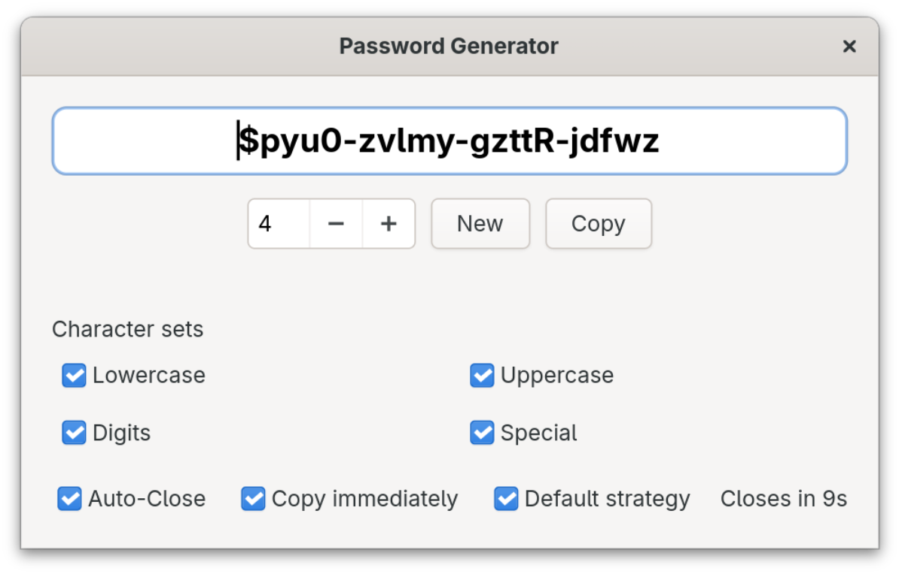

# Password Generator – Flathub Packaging

This repository packages the Password Generator GTK4 app as a Flatpak for Flathub.

## Screenshots (v0.5.1)




## Highlights

- Grouped output for readability (5-character groups by default).
- Adjustable length via group count to match your security needs.
- Optional auto-close timer after copying for better security hygiene.
- Clipboard integration with "copy immediately" toggle and a transient green check confirmation.
- Remembers your preferred settings between sessions.
- Locale-aware UI (English, German, Japanese, Swedish, Spanish, Italian, French).
- Respects system light/dark preference and accent colors; dark mode is the default to reduce glare.
- Character set controls: lowercase, uppercase, digits, and specials.

Install from Flathub:

```bash
flatpak install flathub io.github.danst0.passwordgenerator
```

## Redesign options (pick one)

1) Flat shield on charcoal: saturated blue shield on dark charcoal background, high-contrast padlock cutout, no drop shadow; subtle inner stroke for depth.
2) Neon terminal vibe: monospaced "PW" glyph with green accent on deep navy, soft grid in the back, rounded square mask to match GNOME style.
3) Gradient dusk: purple-to-teal diagonal gradient behind a simplified white keyhole, 80% canvas fill, thick outline for crispness in dark mode.
