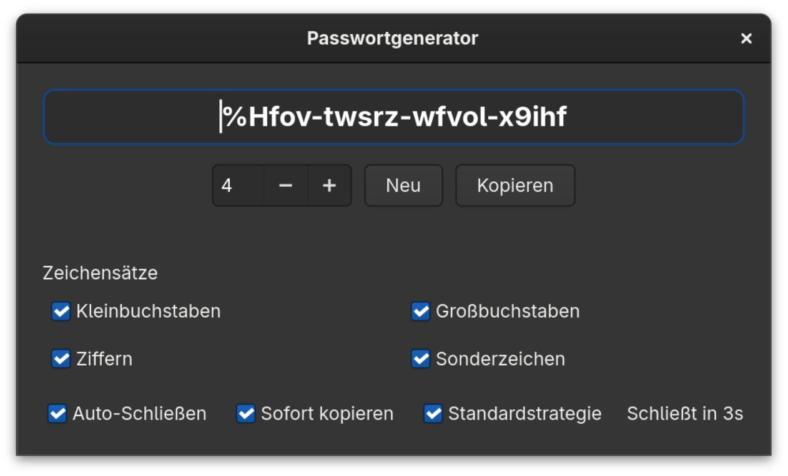

# Password Generator – Flathub Packaging

This repository packages the Password Generator GTK4 app as a Flatpak for Flathub.

## Screenshot (v0.4.0)



## Highlights

- Grouped output for readability (5-character groups by default).
- Adjustable length via group count to match your security needs.
- Optional auto-close timer after copying for better security hygiene.
- Clipboard integration with "copy immediately" toggle and a transient green check confirmation.
- Remembers your preferred settings between sessions.
- Locale-aware UI (English, German, Japanese, Swedish, Spanish, Italian, French).
- Respects system light/dark preference and accent colors.
- Character set controls: lowercase, uppercase, digits, and specials.

Install from Flathub:

```bash
flatpak install flathub io.github.danst0.passwordgenerator
```
